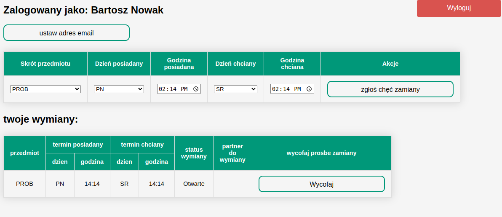
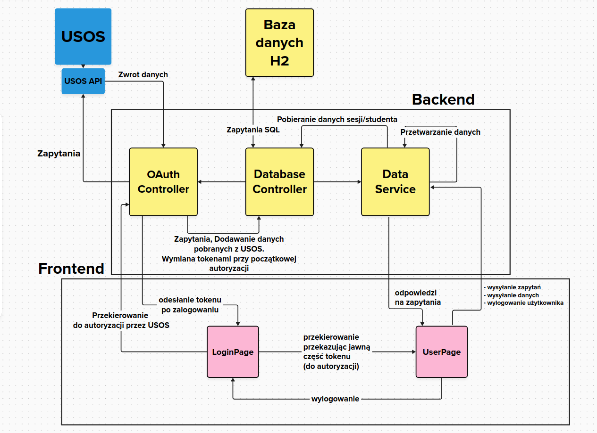

# DajLabki
## College project for exchanging lectures among students and instructors.
DajLabki is an app that simplifies student exchanges. Post your request for items or services, and get matched with others who have similar needs.
## My part of the project
My role involved implementing the Java Spring database into the project and assisting with the integration of endpoints into the UI forms.
## Screenshots

## Class diagram

